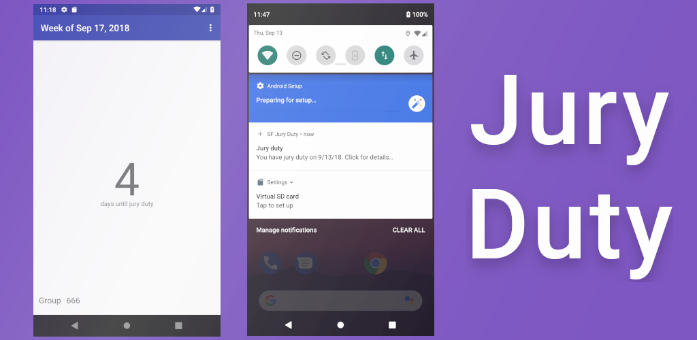

# SF Jury Duty

Live in San Francisco? Got a letter for jury duty?

The letter tells you to visit the website at some date a few weeks in the future. And you have to check every evening, throughout that week, to see if you have to go in the following day.

Why can't they just tell you, instead of you having to remember?

That's what this app is for!

When you get the letter, just enter the start date and your group number into SF Jury Duty, and save.

When the date approaches, the app will check the website every evening and let you know whether or not your group was called.

## Use it

Install from Google Play Store: https://play.google.com/store/apps/details?id=com.philoertel.juryduty.

## Build

Steps to check out the project in Android Studio:

1. Check out a project from Github
2. Choose juryduty
3. Would you like to open the project? Say No. If you say Yes here, the project won't be setup correctly. You won't see the project structure or files, and the project won't build. If this happense, close and delete the project, delete the project directory from disk, and start over.
4. Import an existing project
5. Navigate to juryduty > build.gradle
6. Unregistered VCS root detected: ~/StudioProjects/juryduty. Choose Add root.

Run the app to test.

To install pre-commit hooks:

```shell
cd .git/hooks
ln -s ../../git-hooks/pre-commit.sh pre-commit
```
